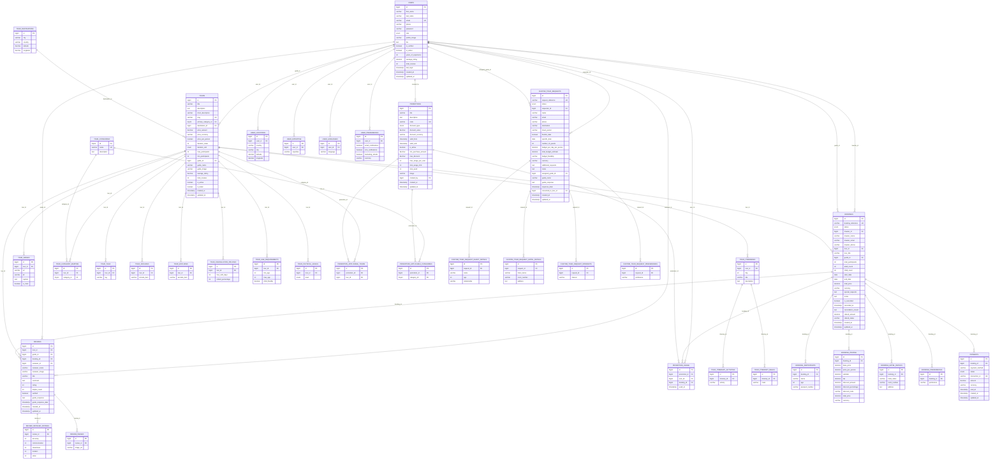

# tm-go-api

## Database Schema ER Diagram

```mermaid
erDiagram
    USERS ||--o{ TOURS : "guide_id"
    USERS ||--o{ BOOKINGS : "traveler_id"
    USERS ||--o{ BOOKINGS : "guide_id"
    USERS ||--o{ REVIEWS : "reviewer_id"
    USERS ||--o{ REVIEWS : "guide_id"
    USERS ||--o{ CUSTOM_TOUR_REQUESTS : "requester_id"
    USERS ||--o{ CUSTOM_TOUR_REQUESTS : "assigned_guide_id"
    USERS ||--o{ PROMOTIONS : "created_by"
    USERS ||--o{ USER_LOCATIONS : "user_id"
    USERS ||--o{ USER_EXPERTISE : "user_id"
    USERS ||--o{ USER_LANGUAGES : "user_id"
    USERS ||--o{ USER_PREFERENCES : "user_id"
    USERS ||--o{ PROMOTION_USAGE : "user_id"

    TOURS ||--o{ TOUR_IMAGES : "tour_id"
    TOURS ||--o{ TOUR_ITINERARIES : "tour_id"
    TOURS ||--o{ TOUR_CATEGORY_MAPPING : "tour_id"
    TOURS ||--o{ TOUR_TAGS : "tour_id"
    TOURS ||--o{ TOUR_INCLUDES : "tour_id"
    TOURS ||--o{ TOUR_EXCLUDES : "tour_id"
    TOURS ||--o{ TOUR_CANCELLATION_POLICIES : "tour_id"
    TOURS ||--o{ TOUR_AGE_REQUIREMENTS : "tour_id"
    TOURS ||--o{ TOUR_PHYSICAL_LEVELS : "tour_id"
    TOURS ||--o{ BOOKINGS : "tour_id"
    TOURS ||--o{ REVIEWS : "tour_id"
    TOURS ||--o{ PROMOTION_APPLICABLE_TOURS : "tour_id"

    TOUR_CATEGORIES ||--o{ TOUR_CATEGORY_MAPPING : "category_id"
    TOUR_CATEGORIES ||--o{ PROMOTION_APPLICABLE_CATEGORIES : "category_id"

    TOUR_DESTINATIONS ||--o{ TOURS : "destination_id"

    TOUR_ITINERARIES ||--o{ TOUR_ITINERARY_ACTIVITIES : "itinerary_id"
    TOUR_ITINERARIES ||--o{ TOUR_ITINERARY_MEALS : "itinerary_id"

    BOOKINGS ||--o{ BOOKING_PARTICIPANTS : "booking_id"
    BOOKINGS ||--o{ BOOKING_PRICING : "booking_id"
    BOOKINGS ||--o{ BOOKING_HOTEL_DETAILS : "booking_id"
    BOOKINGS ||--o{ BOOKING_PREFERENCES : "booking_id"
    BOOKINGS ||--o{ PAYMENTS : "booking_id"
    BOOKINGS ||--o{ REVIEWS : "booking_id"
    BOOKINGS ||--o{ PROMOTION_USAGE : "booking_id"

    REVIEWS ||--o{ REVIEW_DETAILED_RATINGS : "review_id"
    REVIEWS ||--o{ REVIEW_IMAGES : "review_id"

    CUSTOM_TOUR_REQUESTS ||--o{ CUSTOM_TOUR_REQUEST_GUEST_DETAILS : "request_id"
    CUSTOM_TOUR_REQUESTS ||--o{ CUSTOM_TOUR_REQUEST_HOTEL_DETAILS : "request_id"
    CUSTOM_TOUR_REQUESTS ||--o{ CUSTOM_TOUR_REQUEST_INTERESTS : "request_id"
    CUSTOM_TOUR_REQUESTS ||--o{ CUSTOM_TOUR_REQUEST_PREFERENCES : "request_id"

    PROMOTIONS ||--o{ PROMOTION_APPLICABLE_CATEGORIES : "promotion_id"
    PROMOTIONS ||--o{ PROMOTION_APPLICABLE_TOURS : "promotion_id"
    PROMOTIONS ||--o{ PROMOTION_USAGE : "promotion_id"

    USERS {
        bigint id PK
        varchar first_name
        varchar last_name
        varchar email UK
        varchar phone
        varchar password
        enum role
        varchar profile_image
        text bio
        boolean is_verified
        boolean is_active
        int years_of_experience
        decimal average_rating
        int total_reviews
        timestamp last_login
        timestamp created_at
        timestamp updated_at
    }

    USER_LOCATIONS {
        bigint id PK
        bigint user_id FK
        varchar country
        varchar city
        decimal latitude
        decimal longitude
    }

    USER_EXPERTISE {
        bigint id PK
        bigint user_id FK
        varchar expertise
    }

    USER_LANGUAGES {
        bigint id PK
        bigint user_id FK
        varchar language
    }

    USER_PREFERENCES {
        bigint id PK
        bigint user_id FK
        boolean email_notifications
        boolean sms_notifications
        boolean marketing_emails
        varchar currency
    }

    TOUR_CATEGORIES {
        tinyint id PK
        varchar name UK
        text description
    }

    TOUR_DESTINATIONS {
        bigint id PK
        varchar city
        varchar country
        decimal latitude
        decimal longitude
    }

    TOURS {
        bigint id PK
        varchar title
        text description
        varchar short_description
        varchar slug UK
        tinyint primary_category_id FK
        bigint destination_id FK
        decimal price_amount
        varchar price_currency
        boolean price_per_person
        int duration_value
        enum duration_unit
        int max_participants
        int min_participants
        bigint guide_id FK
        varchar guide_name
        varchar guide_image
        decimal average_rating
        int total_reviews
        boolean is_active
        boolean is_listed
        timestamp created_at
        timestamp updated_at
    }

    TOUR_IMAGES {
        bigint id PK
        bigint tour_id FK
        varchar url
        varchar alt
        text caption
        boolean is_main
    }

    TOUR_CATEGORY_MAPPING {
        bigint id PK
        bigint tour_id FK
        tinyint category_id FK
    }

    TOUR_TAGS {
        bigint id PK
        bigint tour_id FK
        varchar tag
    }

    TOUR_ITINERARIES {
        bigint id PK
        bigint tour_id FK
        int day
        varchar title
        text description
    }

    TOUR_ITINERARY_ACTIVITIES {
        bigint id PK
        bigint itinerary_id FK
        varchar activity
    }

    TOUR_ITINERARY_MEALS {
        bigint id PK
        bigint itinerary_id FK
        varchar meal
    }

    TOUR_INCLUDES {
        bigint id PK
        bigint tour_id FK
        varchar include_item
    }

    TOUR_EXCLUDES {
        bigint id PK
        bigint tour_id FK
        varchar exclude_item
    }

    TOUR_CANCELLATION_POLICIES {
        bigint id PK
        bigint tour_id FK
        int free_until_days
        int refund_percentage
    }

    TOUR_AGE_REQUIREMENTS {
        bigint id PK
        bigint tour_id FK
        int min_age
        int max_age
        boolean child_friendly
    }

    TOUR_PHYSICAL_LEVELS {
        bigint id PK
        bigint tour_id FK
        enum level
    }

    BOOKINGS {
        bigint id PK
        varchar booking_reference UK
        enum status
        bigint traveler_id FK
        varchar traveler_name
        varchar traveler_email
        varchar traveler_phone
        bigint tour_id FK
        varchar tour_title
        bigint guide_id FK
        int total_participants
        int adult_count
        int child_count
        date start_date
        date end_date
        decimal total_price
        varchar currency
        text special_requests
        text notes
        boolean is_cancelled
        timestamp cancelled_at
        text cancellation_reason
        decimal refund_amount
        varchar refund_status
        timestamp created_at
        timestamp updated_at
    }

    BOOKING_PARTICIPANTS {
        bigint id PK
        bigint booking_id FK
        varchar name
        int age
        varchar passport_number
    }

    BOOKING_PRICING {
        bigint id PK
        bigint booking_id FK
        decimal base_price
        decimal price_per_person
        decimal subtotal
        decimal tax
        decimal discount_amount
        decimal discount_percentage
        varchar discount_code
        decimal total_price
        varchar currency
    }

    BOOKING_HOTEL_DETAILS {
        bigint id PK
        bigint booking_id FK
        varchar hotel_name
        varchar room_number
        text address
    }

    BOOKING_PREFERENCES {
        bigint id PK
        bigint booking_id FK
        varchar preference
    }

    PAYMENTS {
        bigint id PK
        bigint booking_id FK
        varchar payment_method
        enum status
        varchar transaction_id UK
        decimal amount
        varchar currency
        timestamp paid_at
        timestamp created_at
        timestamp updated_at
    }

    REVIEWS {
        bigint id PK
        bigint tour_id FK
        bigint guide_id FK
        bigint booking_id FK
        bigint reviewer_id FK
        varchar reviewer_name
        varchar reviewer_image
        varchar title
        text comment
        int rating
        int helpful_count
        boolean verified
        text guide_response
        timestamp guide_response_date
        timestamp created_at
        timestamp updated_at
    }

    REVIEW_DETAILED_RATINGS {
        bigint id PK
        bigint review_id FK
        int accuracy
        int communication
        int cleanliness
        int location
        int value
    }

    REVIEW_IMAGES {
        bigint id PK
        bigint review_id FK
        varchar image_url
    }

    CUSTOM_TOUR_REQUESTS {
        bigint id PK
        varchar request_reference UK
        enum status
        bigint requester_id FK
        varchar name
        varchar email
        varchar phone
        varchar destination
        varchar travel_period
        boolean flexible_date
        date specific_date
        int number_of_guests
        decimal budget_per_day_per_person
        decimal total_budget_estimate
        varchar budget_flexibility
        varchar currency
        text additional_requests
        text notes
        bigint assigned_guide_id FK
        varchar guide_name
        text guide_response
        timestamp response_date
        bigint converted_to_tour_id FK
        timestamp created_at
        timestamp updated_at
    }

    CUSTOM_TOUR_REQUEST_GUEST_DETAILS {
        bigint id PK
        bigint request_id FK
        varchar name
        int age
        varchar relationship
    }

    CUSTOM_TOUR_REQUEST_HOTEL_DETAILS {
        bigint id PK
        bigint request_id FK
        varchar hotel_name
        varchar room_number
        text address
    }

    CUSTOM_TOUR_REQUEST_INTERESTS {
        bigint id PK
        bigint request_id FK
        varchar interest
    }

    CUSTOM_TOUR_REQUEST_PREFERENCES {
        bigint id PK
        bigint request_id FK
        varchar preference
    }

    PROMOTIONS {
        bigint id PK
        varchar title
        text description
        varchar code UK
        enum discount_type
        decimal discount_value
        varchar discount_currency
        timestamp valid_from
        timestamp valid_until
        boolean is_active
        decimal min_purchase_amount
        decimal max_discount
        int max_usage_per_user
        int total_usage_limit
        int total_used
        varchar image
        bigint created_by FK
        timestamp created_at
        timestamp updated_at
    }

    PROMOTION_APPLICABLE_CATEGORIES {
        bigint id PK
        bigint promotion_id FK
        tinyint category_id FK
    }

    PROMOTION_APPLICABLE_TOURS {
        bigint id PK
        bigint promotion_id FK
        bigint tour_id FK
    }

    PROMOTION_USAGE {
        bigint id PK
        bigint promotion_id FK
        bigint user_id FK
        bigint booking_id FK
        timestamp used_at
    }
```

For detailed schema documentation, see [SQL_SCHEMA_DESIGN.md](SQL_SCHEMA_DESIGN.md)